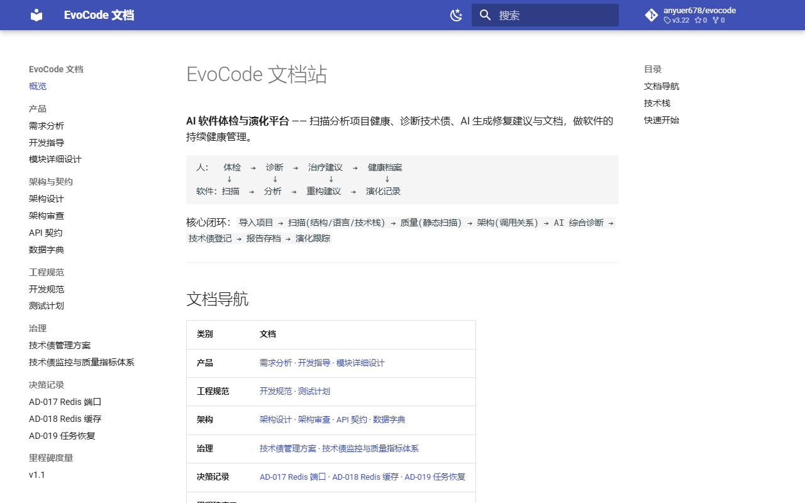

# EvoCode

[简体中文](README.md) | English

[](https://github.com/anyuer678/evocode)
[](LICENSE)
[](https://anyuer678.github.io/evocode/frontend/)
[](https://github.com/anyuer678/evocode)
[](https://github.com/anyuer678/evocode)
[](https://anyuer678.github.io/evocode/)
[](https://github.com/anyuer678/evocode/actions/workflows/ci.yml)

> **Status**: `local-tool` / `portfolio` · **Local software health-check tool** (no multi-user auth; do not expose to the public internet)
> **AI software health check & evolution** — rule-engine-first static diagnostics with optional LLM augmentation, delivering a "checkup + advice + health record" for software.
> The core value is **deterministic rule scanning**; without `LLM_API_KEY` it automatically degrades to the rule-based report.

This is **not** an AI code-writing tool (unlike Cursor / Copilot) and **not** a plain code reviewer — it is a **software health management platform**:

<p align="center"></p>


```
Human:  checkup  →  diagnosis  →  treatment advice  →  health record
          ↓          ↓              ↓                  ↓
Software: scan    →  analyze    →  refactor advice  →  evolution log
```

> **Security boundary note**: this project has **no authentication** and listens only on `127.0.0.1` (localhost). Analyzer↔Backend communication is local-only. CI excludes integration tests that require real PostgreSQL/Redis (`EvocodeApplicationTests`). Do not expose ports in untrusted network environments.

## Online demo

| | Address | Notes |
|---|---|---|
| 🖥️ Frontend demo | [anyuer678.github.io/evocode/frontend/](https://anyuer678.github.io/evocode/frontend/) | UI interaction preview (static only, no backend data) |
| 📚 Docs site | [anyuer678.github.io/evocode/](https://anyuer678.github.io/evocode/) | Requirements / architecture / API contracts / data dictionary — full docs |

## Features

| Domain | Description |
|---|---|
| 🧬 12 static analysis families | quality / architecture (layering + cycles) / evolution / dependencies + **security / complexity / duplication / error handling / style / legacy markers / oversized methods & classes / magic numbers** (works even when Sonar is unavailable) |
| 🩺 Diagnostics | every finding ships "impact + actionable fix" (rule engine, LLM not required); **line-by-line file annotations** with hover advice |
| 🏥 Health score | rule-based + LLM-augmented composite score (quality/structure/dependency/size, 4 dims, reproducible) |
| 💬 AI doctor | RAG-retrieval Q&A + SSE streaming + citation tracing (anti-hallucination) |
| 🗂️ Tech debt | multi-source aggregation + state machine + manual registration, closed-loop tracking |
| 📄 Doc generation | README / architecture / API docs (LLM-generated; rule-based fallback without a key) |
| 📈 Reports | AI report + historical trend comparison + Markdown export |
| 📦 Project import | zip upload / GitHub clone / archive quick-scan / file map |

## Quick start

**Option 1: Windows one-command start** (recommended)

```bat
scripts\start-dev.bat     :: infra → db migrations → analyzer → backend → frontend → health checks
scripts\dev-down.bat      :: stop services (containers keep data)
```

**Option 2: manual steps** (any platform)

```bash
docker compose up -d                              # postgres(pgvector) / redis
scripts/init-db.sh                                # runs db/migration/V*.sql (idempotent)

cd analyzer && pip install -r requirements.txt
cd analyzer && python -m uvicorn app.main:app --host 127.0.0.1 --port 8091

cd backend && java -jar target/evocode-backend-0.1.0-SNAPSHOT.jar

cd frontend && npm install && npm run dev
```

Open http://localhost:5173 → create a project (upload a zip or give a GitHub URL) → run analysis → view the health report / architecture / evolution / AI doctor / tech debt / docs.

**Configuration (optional)**: copy `.env.example` to `.env` and set as needed:

```env
# AI doctor / doc generation (without it: reports fall back to rule-based, AI doctor returns LLM_NO_KEY, docs cannot be generated)
LLM_API_KEY=sk-xxx
LLM_BASE_URL=http://127.0.0.1:11434/v1   # Ollama / DeepSeek etc. OpenAI-compatible endpoints
```

> Prerequisites: JDK 17+, Node 20+, Python 3.11+, Docker Desktop, Git.
> SonarQube is optional (`docker compose --profile full up -d`); when not configured, quality dimensions degrade automatically without blocking the analysis pipeline.

## Architecture

```
               Web UI (Vue3 + TS + Vite + ECharts)
                          │  /api/v1
                Spring Boot 3 (Java 17)
              project mgmt · task orchestration · persistence
                          │  /analyze/v1 (127.0.0.1 only)
              Python Analyzer (FastAPI)
      scan/languages/stack │ quality(Sonar) │ architecture(tree-sitter) │ evolution(git) │ AI(LLM+RAG)
                          │
        PostgreSQL(pgvector) · Redis · on-disk repos(data/) · LLM API (OpenAI-compatible)
```

## Tech stack

| Layer | Technology |
|---|---|
| Frontend | Vue 3 + TypeScript + Vite + ECharts + Naive UI + Pinia + vitest |
| Backend | Spring Boot 3.3 (Java 17) + MyBatis-Plus + Lombok |
| Analyzer | Python 3.11 + FastAPI + tree-sitter (Python/Java/JS/TS/Go) + pgvector |
| AI | OpenAI-compatible LLM API (DeepSeek/OpenAI/Ollama) + RAG (bge-m3 vectors, keyword fallback) |
| Infra | PostgreSQL(pgvector) + Redis + Docker Compose |
| Quality tools | SonarQube (optional) + ESLint/Prettier + ruff |

## Documentation

Full docs at the [📚 docs site](https://anyuer678.github.io/evocode/), source in `docs/`:

- Requirements · Architecture · API contracts · Data dictionary
- Development conventions · Test plan · decision records in `docs/decisions/`
- (Chinese file names under `docs/`; links in the Chinese README: [README.md](README.md))

## FAQ

| Symptom | Fix |
|---|---|
| Page APIs 500 (project list fails to load) | Run `scripts\check-env.ps1` first; usually the backend isn't ready — verify with `curl http://127.0.0.1:18080/api/v1/health` |
| `start-dev.bat` stuck on the docker step | Docker Desktop engine isn't running; start it and retry |
| Evolution/tech debt empty | zip upload (not git) → evolution unavailable is expected; tech debt needs architecture/quality/evolution data |
| AI doctor reports LLM not configured | Set `LLM_API_KEY` in `.env` and restart |

## Contributing

Contributions welcome! Bug reports, feature requests, and code improvements — see [CONTRIBUTING.md](CONTRIBUTING.md). All contributions are published under this project's GPL-3.0 license by default.

## Disclaimer

This project is for learning, exchange, and demonstration purposes only; it is not a commercial service and carries no technical guarantees. The software is provided "AS IS" without any express or implied warranties, including but not limited to merchantability, fitness for a particular purpose, and non-infringement.

You understand and agree that using this project is at your own risk. Defects and issues may be reported via GitHub Issues, but the author accepts no liability for any loss arising from use of this software (including but not limited to data loss, business interruption, or third-party claims).

The project's architecture, security baseline, fault tolerance, and performance have not been validated or hardened to production-grade standards; it is not suitable for production environments or mission-critical scenarios. Deploying it into production, exposing it as a public service, or wiring it into real business workflows is the user's own decision; the developer bears no responsibility for any resulting consequences (including service outages, data corruption or leakage, business loss, compliance risk, or third-party disputes). For genuine production use, conduct your own evaluation and hardening (security audit, stress testing, code review, etc.) and accept the risks yourself.

**Security statement**: this project has **no authentication/authorization** and listens only on `127.0.0.1` (localhost) by default, relying on OS-level network isolation. The Analyzer API accepts local requests only. CI excludes integration tests that need a real database. If you need multi-host/public-network use, add an auth layer yourself.

## License

Licensed under **GPL-3.0**. Full text in [LICENSE](LICENSE).

Detailed version history in [CHANGELOG.md](CHANGELOG.md).


---

## Full-stack compose & bind guardrails

- Full infrastructure set: [`docker-compose.full.yml`](docker-compose.full.yml) (ports bound to `127.0.0.1` only)
- Docs: [`docs/DEPLOY_FULL.md`](docs/DEPLOY_FULL.md)
- Check: `python scripts/check_bind_guard.py` (non-localhost hosts rejected by default)
- Analyzer safe start: `python analyzer/run.py` (default `127.0.0.1:8091`; only `EVOCODE_ALLOW_PUBLIC_BIND=1` allows other hosts)
